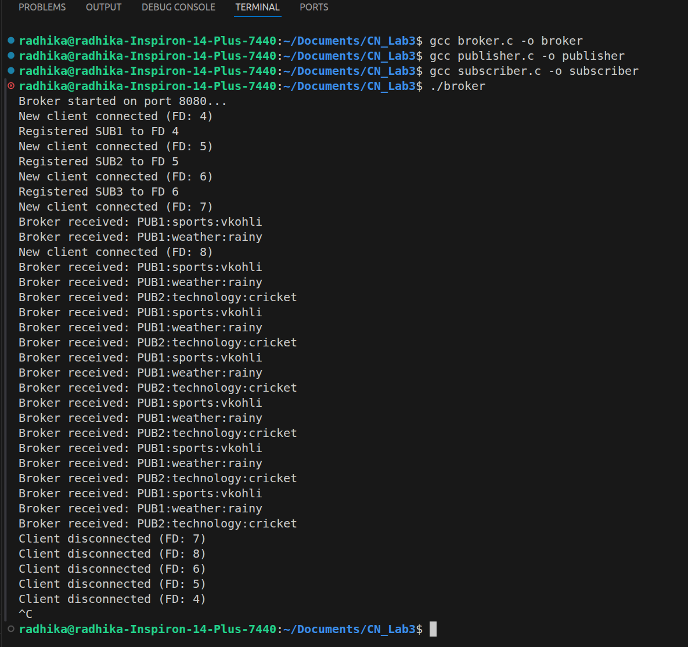
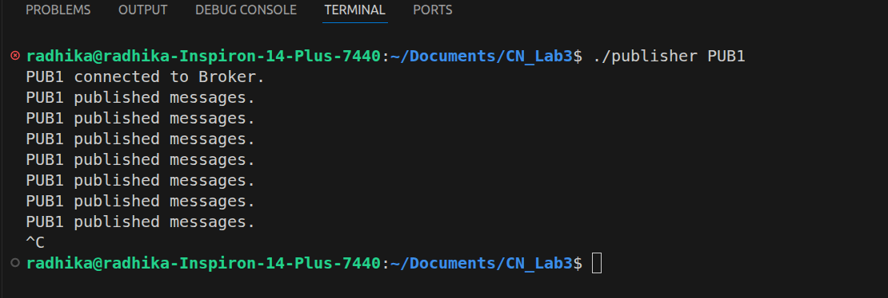
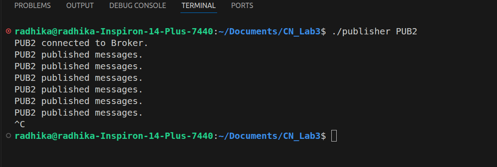
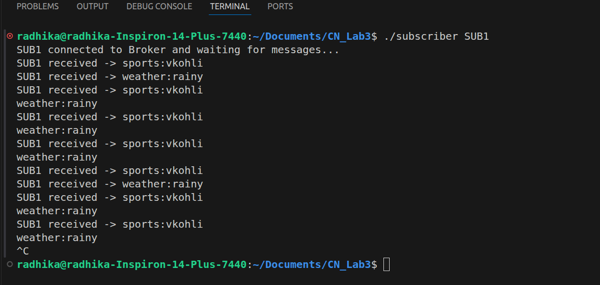
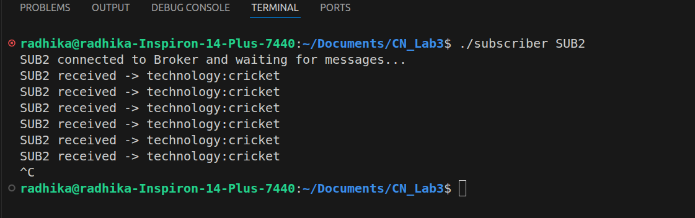
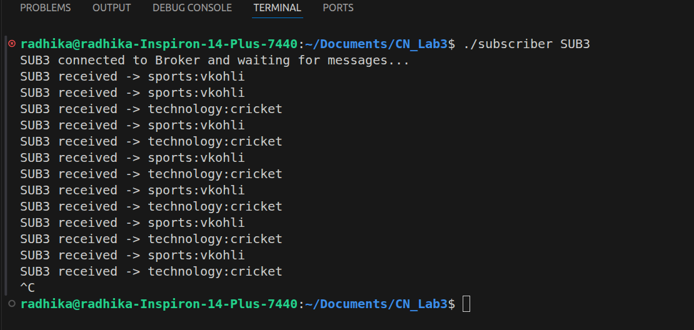

# Publisher-Subscriber Messaging System (TCP/Sockets)

## Overview
This system implements a Publisher-Subscriber messaging architecture using TCP Sockets in C. It consists of three components:
1. **Broker Server:** Acts as an intermediary routing messages based on predefined topic rules using the `poll()` system call for concurrency.
2. **Publishers (PUB1, PUB2):** Produce messages for specific topics.
3. **Subscribers (SUB1, SUB2, SUB3):** Consume messages based on fixed topic subscriptions.

## Input / Output Format
* **Publisher to Broker:** `<PUB_ID>:<TOPIC>:<MESSAGE>\n`
  * *Example:* `PUB1:sports:vkohli\n`
* **Broker to Subscriber:** `<TOPIC>:<MESSAGE>\n`
  * *Example:* `sports:vkohli\n`
* Note: A newline character (`\n`) is used as a delimiter to ensure messages sent simultaneously (like PUB1's dual transmission) are parsed correctly by the broker.

## Prerequisites
- GCC Compiler (`gcc`)
- A Linux/Unix-based terminal (for the `poll()` system call and threading behavior).

## Compilation Instructions
Open your terminal in the directory where your `.c` files are located and compile the three components using the following commands:

```bash
gcc broker.c -o broker
gcc publisher.c -o publisher
gcc subscriber.c -o subscriber
```
## Execution Instructions
Because the system requires persistent connections and multiple concurrent clients, you should run these executables in separate terminal windows (or use background processes).

Follow this exact order to ensure successful connection routing:

Step 1: Start the Broker
```bash
./broker
```
(Leave this terminal running. It will output connection statuses and routing logs.)

Step 2: Start the Subscribers
Open three new terminals and run each subscriber:
```bash
./subscriber SUB1
./subscriber SUB2
./subscriber SUB3
```

Step 3: Start the Publishers
Open two more terminals. To observe the 5-second alternating behavior correctly, launch them roughly at the same time:
```bash
./publisher PUB1
./publisher PUB2
```
## Expected Behavior Simulation

    At t = 0: PUB1 sends sports:vkohli and weather:rainy. SUB1 will print both; SUB3 will print the sports message.

    At t = 5: PUB2 sends technology:cricket. SUB2 and SUB3 will print this message.

    At t = 10: PUB1 sends again.

    This cycle repeats indefinitely until the processes are terminated via Ctrl+C.

## Test screenshots

### Broker Terminal


### Publisher Terminals
!*(Shows PUB1 and PUB2 alternating their published messages)*

**Publisher 1 Output**


**Publisher 2 Output**


### Subscriber Terminals
!*(Shows SUB1, SUB2, and SUB3 receiving their respective topic-filtered messages)*

**Subscriber 1 Output**


**Subscriber 2 Output**


**Subscriber 3 Output**


